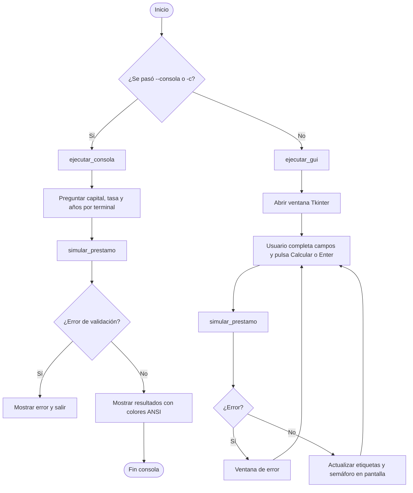
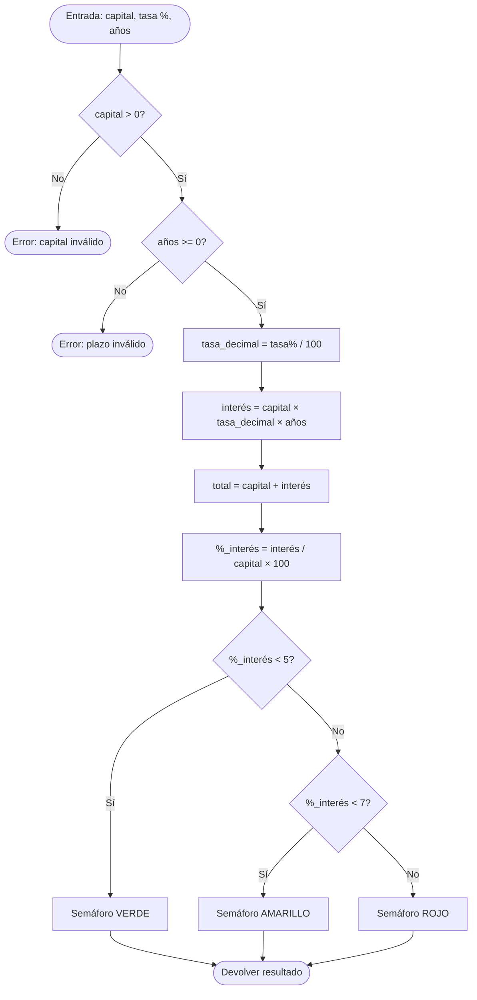

# Simulador financiero (Python)

Aplicación educativa que estima el costo de un **préstamo con interés simple** y muestra un **semáforo de alerta** según qué tan elevado es el interés en relación con el capital prestado. Puedes usarla con **interfaz gráfica** (ventana) o por **consola**, según prefieras.

---

## Objetivo del proyecto

- **Aprender y practicar** el cálculo de interés simple en un contexto de préstamo.
- **Interpretar el resultado** no solo en pesos/dólares, sino como **porcentaje del capital**: el semáforo (verde / amarillo / rojo) ayuda a ver de un vistazo si el interés acumulado es bajo, moderado o alto según los umbrales definidos en el código.
- **Unificar la lógica** en una sola función (`simular_prestamo`) para que **GUI y consola** compartan el mismo comportamiento y no haya dos versiones del cálculo.

---

## Qué calcula el simulador

Con estos datos de entrada:

| Dato | Descripción |
|------|-------------|
| **Capital** | Monto del préstamo |
| **Tasa anual** | Porcentaje de interés por año (acepta coma o punto, p. ej. `5,5` o `5.5`) |
| **Plazo** | Número de años |

Se obtiene:

1. **Interés total (interés simple)**  
   `interés = capital × (tasa_anual_en_porcentaje / 100) × años`

2. **Total a pagar**  
   `total = capital + interés`

3. **Porcentaje de interés respecto al capital**  
   `% = (interés / capital) × 100`  
   (Este valor es el que alimenta el semáforo.)

### Semáforo de alerta

El color depende del **porcentaje de interés sobre el capital** (no de la tasa nominal sola):

| Condición | Nivel |
|-----------|--------|
| Menor que 5 % | **VERDE** |
| De 5 % a menos de 7 % | **AMARILLO** |
| 7 % o más | **ROJO** |

> Los umbrales son arbitrarios y didácticos; en un producto real convendría definirlos con criterio financiero o regulatorio.

---

## Características

- **Interfaz gráfica** con Tkinter: campos de entrada, botón Calcular, resultados y indicador de color.
- **Modo consola** con el mismo cálculo, banner ASCII y colores ANSI en terminales compatibles.
- **Validaciones básicas**: capital positivo, plazo en años entero y no negativo; mensajes claros si los datos no son válidos.

---

## Requisitos

- **Python 3.8+** (recomendado 3.10 o superior).
- **Tkinter**: suele venir incluido con Python en Windows. Si en Linux falta, instala el paquete de tu distribución (p. ej. `python3-tk` en Debian/Ubuntu).

---

## Cómo ejecutarlo

Abre una terminal en la carpeta del proyecto y ejecuta:

```bash
python main.py
```

Esto abre la **interfaz gráfica**.

Para usar solo la **consola** (preguntas y respuestas por terminal):

```bash
python main.py --consola
```

Forma abreviada:

```bash
python main.py -c
```

En Windows, si `python` no funciona, prueba `py main.py` o la ruta completa a tu intérprete.

---

## Estructura del proyecto

```
Simulador-Financiero-Python/
├── main.py      # Lógica del préstamo, CLI, GUI y punto de entrada
└── README.md    # Este archivo
```

### Piezas principales en `main.py`

| Elemento | Rol |
|----------|-----|
| `simular_prestamo` | Núcleo: valida entradas y devuelve interés, total, % y semáforo. |
| `_parse_float_es` | Convierte texto a número (coma decimal estilo español). |
| `ejecutar_consola` | Flujo interactivo por terminal. |
| `ejecutar_gui` | Ventana Tkinter y botón Calcular. |
| `main` / `argparse` | Elige entre GUI (por defecto) y `--consola`. |

---

## Flujogramas

### 1. Inicio del programa (elección de modo)



### 2. Lógica del préstamo y semáforo



---

## Notas

- El modelo es **interés simple**: el interés no se capitaliza año a año. Para créditos reales a menudo se usa interés compuesto u otras reglas.
- El proyecto encaja bien en cursos de **programación con Python** (incluida POO si amplías el código con clases) donde se prioriza claridad, una sola fuente de verdad para los cálculos y dos interfaces para el mismo núcleo.

---

## Licencia y autoría

Define aquí la licencia y los autores si el proyecto es para entrega académica o repositorio público.
